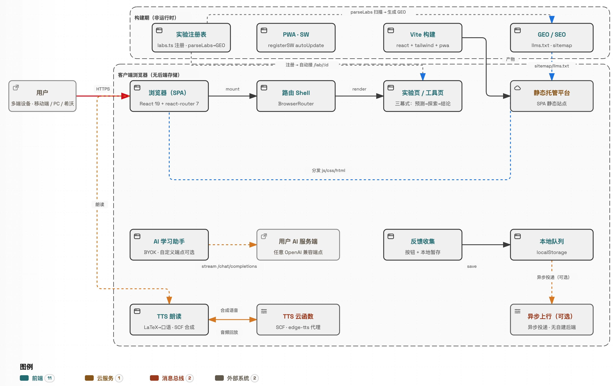
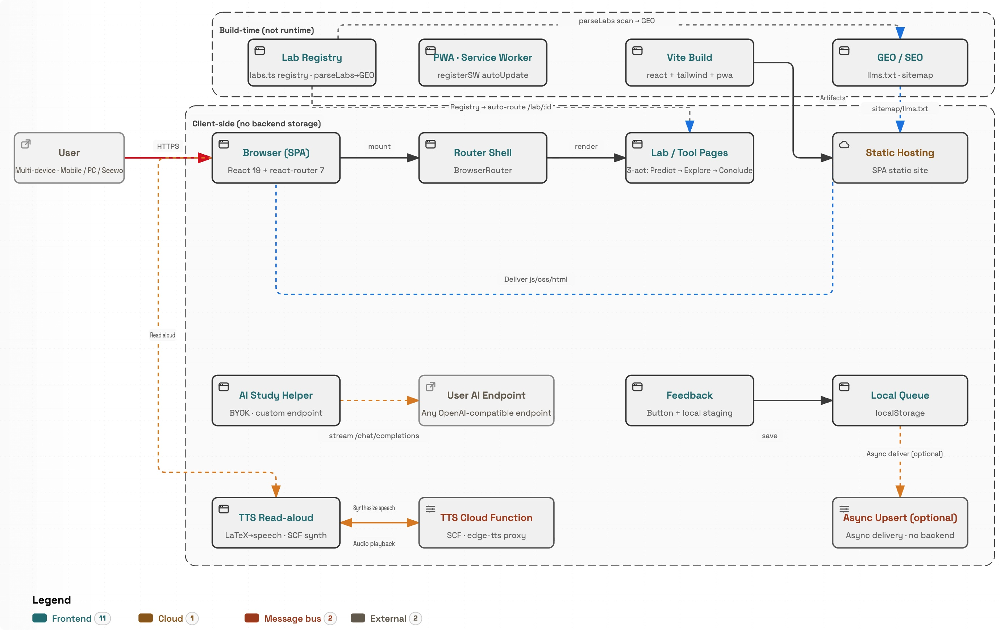

<div align="center">

# 数理化数字实验室


    

<p>基于初中 7-9 年级课程大纲的数学、物理、化学数字实验与探究平台。<br/>本地运行 · 无需登录 · 中英双语 · 深浅主题 · 在线访问：<a href="https://stem.irky.dev">https://stem.irky.dev</a></p>

<table align="center">
  <thead>
    <tr><th align="center">在线访问 &nbsp;·&nbsp; Visit</th><th align="center">介绍视频 &nbsp;·&nbsp; Intro video</th></tr>
  </thead>
  <tbody>
    <tr>
      <td align="center"><br/>手机扫码访问</td>
      <td align="center"><br/>手机扫码观看介绍视频</td>
    </tr>
  </tbody>
</table>

</div>

---

**[中文](#中文说明) · [English](#english)**

## 中文说明

- [简介](#简介)
- [实验与工具清单](#实验与工具清单)
- [运行架构](#运行架构)
- [快速开始](#快速开始)
- [三幕式探究](#三幕式探究)
- [元素周期表工具](#元素周期表工具)
- [AI 学习助手](#ai-学习助手)
- [每日科学](#每日科学)
- [项目结构](#项目结构)
- [反馈](#反馈)
- [许可](#许可)
- [免责条款](#免责条款)

### 简介

数理化数字实验室是一个**无需登录**的初中 STEM 探究空间，每个实验遵循**三幕式探究**（预测 → 探索 → 结论），鼓励学生先猜想、再操作、后归纳，而非被动跟随固定步骤。

- 🌐 中英双语，右上角一键切换
- 🌗 深浅主题（默认浅色，适合希沃/投影大屏）
- 📱 响应式：手机 / 平板 / PC / 希沃大屏
- 🎲 首页「随机探索」一键随机进入实验或工具
- 🧪 15 个交互实验 + 4 个查表工具：元素周期表（118 元素 · 实物照片 · 读音）、物理常量速查、物理公式速查、数学公式速查
- 🤖 AI 学习助手（顶栏入口）：支持数学公式排版、多轮问答历史与**回答朗读**（数学公式、化学式按规范读法读出），面板尺寸可自由调整；配置您自己的 AI 服务商 API Key 即可使用，Key 仅存本机、对话直连服务商、本站不记录
- 📦 可安装为应用离线使用（PWA）
- 💬 首页「每日科学」：每天一位科学家的名言、考点速记与小故事

### 实验与工具清单

| 科目 | 年级 | 内容 |
|---|---|---|
| 数学 | 7-9 | 一次函数 · 二次函数 · 反比例函数 · 圆的性质 |
| 物理 | 8-9 | 欧姆定律 · 串并联电路 · 凸透镜成像 · 浮力 · 杠杆 · 压强 · 滑轮 |
| 化学 | 9 | 质量守恒定律 · 酸碱中和 · 电解水 · 金属活动性 |
| 工具 | — | 元素周期表（118 元素 · 检索 · 实物照片 · 读音 · 中考跟读） · 物理常量速查 · 物理公式速查 · 数学公式速查 |

### 运行架构

本项目为**纯前端 SPA**（React 19 + react-router + Tailwind 4），**无自建后端与数据库**，发布为静态站点托管（EdgeOne Pages）。运行架构如下图所示：

<div align="center">
  
</div>

- **静态托管平台**：承接 Vite 构建产物并分发，托管 /s/.../html 路径
- **AI 学习助手**（BYOK）：浏览器直连您自己的 AI 服务商（兼容 OpenAI 端点，流式 /chat/completions），Key 仅存本机、本站无记录
- **TTS 朗读**：LaTeX 口语化格式化 → SCF 云函数代理 edge-tts 合成语音并回放
- **反馈收集**：按钮触发 → 本地队列（localStorage）暂存 →（可选）异步上报，无自建后端、离线可存
- **PWA / SEO**：Service Worker 注册离线更新；构建期生成 sitemap 供搜索引擎抓取

### 快速开始

```bash
npm install        # 安装依赖
npm run dev        # 开发服务器（默认 http://localhost:3000）
npm run build      # 生产构建
npm run preview    # 本地预览构建产物
npm run test       # 运行测试
```

> 局域网访问：开发服务器监听 `0.0.0.0`，启动后其他设备打开 `http://<本机局域网IP>:3000`。
> Node.js 建议使用 nvm 管理的 v24.19.0（npm ≥ 11.10，.npmrc 配置了供应链保护 min-release-age=7）。

### 三幕式探究

每个实验由 **预测 → 探索 → 结论** 三幕构成，**不设硬性步骤锁**，学生可随时返回任意幕：

1. **预测**：先根据已有知识形成猜想，不急着看答案
2. **探索**：拖动滑块、开关、图形，观察参数变化并记录证据
3. **结论**：根据观察完成结论题，再查看反馈与考点速记

> 教学建议：先让学生独立预测 → 再邀请学生描述证据 → 最后共同完成结论。

### 元素周期表工具

- 118 个元素完整表格，支持检索（符号/中文/英文）
- 点击元素查看详情：基础属性（IUPAC 标准原子量 + 不确定度）、百科故事、实物照片（可放大）
- 中文读音（内置离线语音包，支持男 / 女声切换）；**中考跟读**：前 20 号元素、金属活动性顺序、常见元素三清单连读，可调次数与间隔
- 原子结构示意图：点击电子层查看该层电子数

### AI 学习助手

- 顶栏入口，辅助解释初中数学（人教版）、物理（苏科版）、化学（人教版）知识，会结合当前页面内容作答
- 使用您自己的 API Key：支持 DeepSeek / 通义千问 / Kimi / 智谱 GLM / 豆包等预设及自定义端点，本站不提供、不代购、不收取任何费用
- 首次使用先阅读并同意使用须知；Key 仅存本机浏览器，对话直连您所选的服务商，本站无后端、不记录任何内容
- 模型列表在连接成功后自动获取；AI 生成内容仅供参考，请以教材和老师讲解为准
- 支持数学公式排版（行内 / 块级 LaTeX），支持多轮问答历史（同页内可回看），面板尺寸可自由调整（右缘拖宽、右下角斜拉），底部显示当前模型与 token 用量估算
- 点击页面「问 AI」按钮提问，回答末尾会推荐 3 个可继续点击了解的问题并支持「换一批」；不提供自由输入框，问答历史关页即清，不持久保存

### 每日科学

- 首页固定板块：每天展示一位科学家的名言、考点速记与小故事，可一键换一条
- 中英双语，小故事可折叠展开

### 项目结构

```
src/
├── labs/              # 实验组件（math / physics / chemistry）
├── components/
│   ├── lab/           # 共享实验原语（坐标平面/表盘/反馈面板等）
│   │   └── circuit/   # 电路部件（电阻/灯泡/变阻器/电表等 SVG）
│   ├── layout/        # 外壳（Header / Footer）
│   ├── ai/            # AI 学习助手（面板/问 AI 按钮）
│   ├── feedback/      # 反馈气泡与面板 / 分享对话框
│   ├── share/         # 标题内嵌分享按钮
│   └── ui/            # 通用 UI（科目/实验图标、公式、占位页）
├── lib/               # 注册表 / 科目 / i18n / 反馈存储 / 元素数据 / 全局状态
└── pages/             # 首页 / 科目 / 实验 / 周期表 / 使用说明
```

### 反馈

右下角浮动气泡提供**实验反馈**与**项目反馈**，提交后实时推送到开发者（钉钉 / 微信）；离线或网络异常时自动暂存本机，联网后自动补发。无需登录账号。

### 许可

本项目基于 **GNU Affero General Public License v3 (AGPL-3.0)** 开源（见 `LICENSE` 文件，站内也可直接查看全文：`/license`）。你可以自由使用、修改与分发，**但任何衍生作品都必须以 AGPL-3.0 开源**（含通过网络提供的服务），并**保留原作者版权声明**，不允许闭源拿走。

### 免责条款

- 本项目为**教学演示与个人探究**参考工具，不构成任何专业意见或承诺。
- 实验数据、公式与交互结果已尽力校对，但**不保证绝对正确**，教学中请以权威教材为准。
- 反馈会发送给开发者；离线时暂存本机，联网后补发。请对保存于本机的内容自行负责。

---

## English

- [Overview](#overview)
- [Labs & Tools](#labs--tools)
- [Running Architecture](#running-architecture)
- [Getting Started](#getting-started)
- [Three-Act Inquiry](#three-act-inquiry)
- [Periodic Table Tool](#periodic-table-tool)
- [AI Assistant](#ai-assistant)
- [Daily Science](#daily-science)
- [Project Structure](#project-structure)
- [Feedback](#feedback)
- [License](#license)
- [Disclaimer](#disclaimer)

### Overview

**STEM Digital Lab** is a **no-login** middle-school STEM exploration space (Grades 7–9). Live at https://stem.irky.dev. Every lab follows a **three-act inquiry** (Predict → Explore → Conclude) that asks students to guess first, explore freely, then conclude — not to follow fixed step-locks.

- 🌐 Bilingual (zh/en), switchable from the header
- 🌗 Light & dark themes (light by default for classroom projection)
- 📱 Responsive: mobile / tablet / PC / Seewo interactive screen
- 🎲 "Random explore" button on the homepage jumps into a random lab or tool
- 🧪 15 interactive labs + 4 lookup tools: Periodic Table (118 elements · photos · pronunciation · recite), Physics Constants, Physics Formulas, Math Formulas
- 🤖 AI assistant (header entry): renders math formulas, keeps multi-turn history on the page and **reads answers aloud** (formulas and chemical names in standard spoken form), panel size is freely adjustable; configure your own provider API key for science help — key stays on-device, chats go straight to your provider, nothing is logged
- 📦 Installable as an app for offline use (PWA)
- 💬 Daily Science on the homepage: a scientist quote, key-point tip and short story each day

### Labs & Tools

| Subject | Grades | Content |
|---|---|---|
| Math | 7–9 | Linear · Quadratic · Inverse Variation · Circle Properties |
| Physics | 8–9 | Ohm's Law · Circuits · Lens · Buoyancy · Levers · Pressure · Pulleys |
| Chemistry | 9 | Conservation of Mass · Titration · Electrolysis · Metal Activity |
| Tool | — | Periodic Table (118 elements · search · photos · pronunciation · recite) · Physics Constants · Physics Formulas · Math Formulas |

### Running Architecture

This is a **pure front-end SPA** (React 19 + react-router + Tailwind 4) with **no self-hosted backend or database**, published as a static site (EdgeOne Pages). The runtime architecture is shown below:

<div align="center">
  
</div>

- **Static host**: serves the Vite build and distributes /s/.../html paths
- **AI assistant** (BYOK): the browser talks directly to your own AI provider (OpenAI-compatible endpoint, streaming /chat/completions); key stays on-device, nothing is logged
- **TTS read-aloud**: LaTeX is formatted for speech → a SCF cloud function proxies edge-tts to synthesize and play back audio
- **Feedback**: button click → local queue (localStorage) → (optional) async report; no self-hosted backend, works offline
- **PWA / SEO**: Service Worker registers offline updates; sitemap generated at build time for search engines

### Getting Started

```bash
npm install        # Install dependencies
npm run dev        # Dev server (default http://localhost:3000)
npm run build      # Production build
npm run preview    # Preview the build locally
npm run test       # Run tests
```

> LAN access: the dev server listens on `0.0.0.0`; open `http://<your-LAN-IP>:3000` from other devices.
> Node.js: use nvm-managed v24.19.0 (npm ≥ 11.10; .npmrc enables supply-chain guard min-release-age=7).

### Three-Act Inquiry

Each lab is built from **Predict → Explore → Conclude** with **no hard step-locks**; students can revisit any act at any time:

1. **Predict**: make a guess from prior knowledge before seeing the answer
2. **Explore**: drag sliders, switches, or shapes, observe changes, and record evidence
3. **Conclude**: answer conclusion questions, then check feedback and key points

> Teaching suggestion: let students predict independently, invite them to describe evidence, then complete the conclusion together.

### Periodic Table Tool

- All 118 elements with search (symbol / Chinese / English)
- Tap an element for details: properties (IUPAC standard atomic weights with uncertainty), mini-wiki story, and a real photo (tap to enlarge)
- Chinese pronunciation with built-in offline audio (male / female voice switch); **Recite mode**: first 20 elements, activity series, and common elements, with adjustable repeats and gaps
- Bohr diagram: tap a shell to see its electron count

### AI Assistant

- Header entry that helps explain middle-school math (PEP), physics (Su-Ke) and chemistry (PEP), grounded in the current page
- Use your own API key: presets for DeepSeek / Qwen / Kimi / Zhipu GLM / Doubao plus a custom endpoint; this site provides no key, sells nothing, charges nothing
- Read and accept the terms first; your key stays in your browser, chats go straight to your chosen provider, and this site has no backend and logs nothing
- The model list is fetched after a successful connection; AI output is for reference — trust the textbook and your teacher
- Math formulas are rendered properly (inline / block LaTeX); multi-turn history stays viewable on the same page; panel size is adjustable (drag the right edge, or the corner for both dimensions); the footer shows the current model and estimated token usage
- Single-turn Q&A: ask via the "Ask AI" button on the page; each answer suggests 2–3 follow-up questions to tap — no free-text input, and no conversation is stored

### Daily Science

- Fixed block on the homepage: a scientist's quote, key-point tips and short story each day, shuffleable
- Bilingual, with a collapsible story

### Project Structure

```
src/
├── labs/              # Lab components (math / physics / chemistry)
├── components/
│   ├── lab/           # Shared primitives (coord plane / gauges / feedback)
│   │   └── circuit/   # Circuit parts (resistor / bulb / rheostat / meters)
│   ├── layout/        # Shell (Header / Footer)
│   ├── ai/            # AI assistant (panel / ask buttons)
│   ├── feedback/      # Feedback FAB & panel / share dialog
│   ├── share/         # Inline share button
│   └── ui/            # Generic UI (subject/lab icons, formula, placeholders)
├── lib/               # Registry / subjects / i18n / feedback storage / elements / global state
└── pages/             # Home / subject / lab / periodic table / guide
```

### Feedback

A floating bubble at the bottom-right provides **experiment feedback** and **project feedback**, sent to the developer in real time (DingTalk / WeChat); while offline or on network errors it is queued locally and retried automatically. No account is required.

### License

This project is open-sourced under the **GNU Affero General Public License v3 (AGPL-3.0)** (see `LICENSE`; the full text is also available in-app at `/license`). You are free to use, modify, and distribute it, **but any derivative work must be open-sourced under AGPL-3.0** (including services offered over a network) and **must retain the original author's copyright notice** — no closed-source forks are allowed.

### Disclaimer

- This project is a **teaching/demo and personal inquiry** reference tool and does not constitute professional advice or any guarantee.
- Experimental data, formulas, and interactions have been carefully proofread but are **not guaranteed to be error-free**; teaching should defer to authoritative textbooks.
- Feedback is sent to the developer and queued locally while offline. You are responsible for content saved on your own device.

---

**License**: AGPL-3.0 · Author: Ricky (张子熠) · 在线访问 / Live: https://stem.irky.dev
